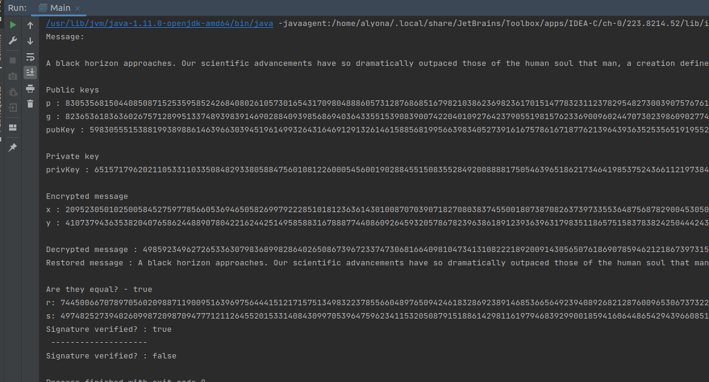
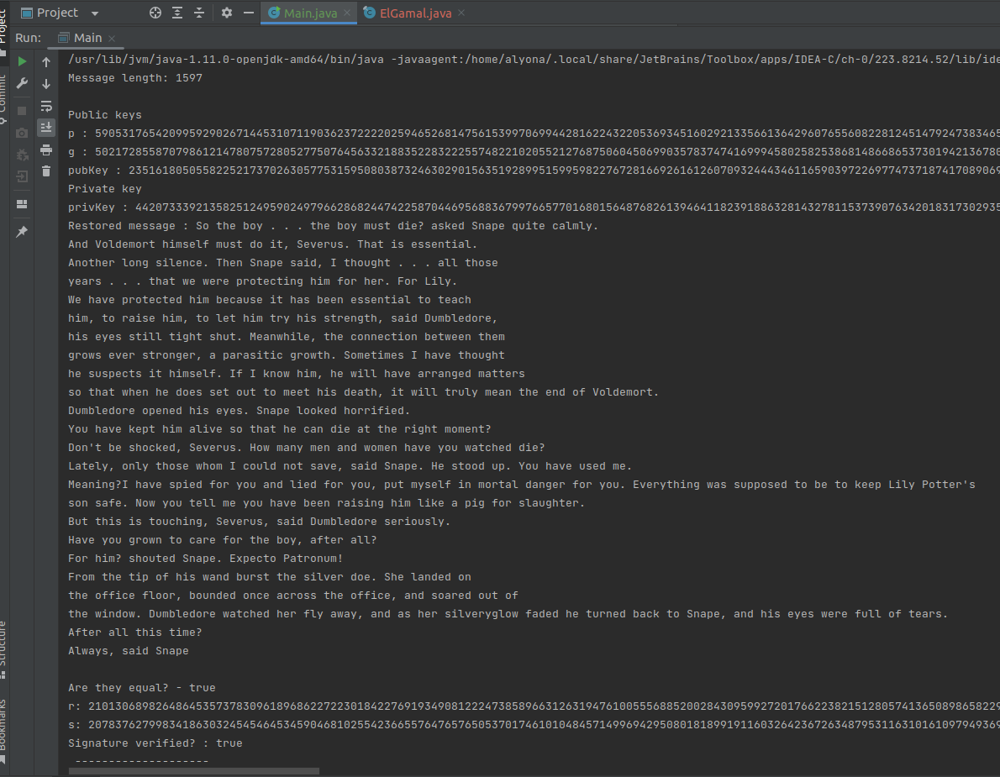

# El-Gamal's algorithm. Digital signature. Directional encryption

## The **src.ElGamal** class is designed to create digital signatures and check them & encrypt/decrypt messages via src.ElGamal

### Implemented functions:
- Directional encryption
    - KeyGen - generates private and public keys
    - Encrypt - encrypts message with public keys
    - Decrypt - decrypts message only with private key

Source with example src.ElGamal digital signature (pages 9-13)
**[ElGamalExample](https://www.flt-info.eu/wp-content/uploads/2022/06/Signatures.pdf)**
- Digital signature
    - CreateDigitalSignature - signs message with private key
    - CheckDigitalSignature - verifies signature with public key

### Execution result:

